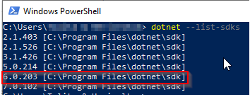
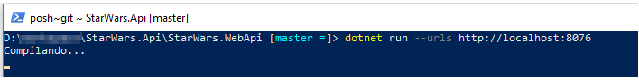
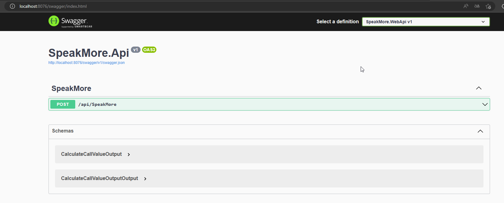
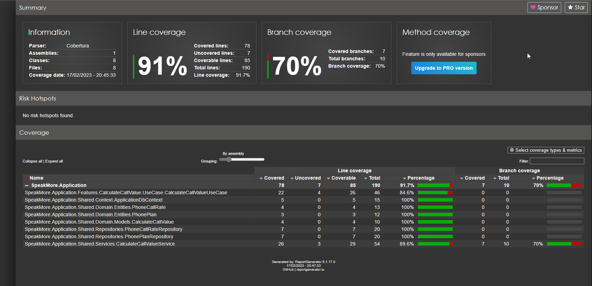

# SpeakMore.Api

Esta Api tem o propósito calcular o custo de uma ligação realizada de um estado para outro. O calculo do custo é baseado no plano contratado.

## Como executar?

Antes de mais nada, valide se você possui o SDK .Net 6 instalado em seu computador

- Abra o Windows PowerShell
- Execute o comando abaixo

` dotnet --list-sdks`

Caso não possua a versão _**6.x**_, você poderá obte-la pelo link oficial da Mirosofit [clicando aqui](https://dotnet.microsoft.com/en-us/download/dotnet/6.0)

- Vá até a pasta _**SpeakMore.WebApi**_ da aplicação no Windows PowerShell
- Execute o comando abaixo para iniciar a aplicação
  `dotnet run --urls http://localhost:8076`

Pronto! Agora é só acessar o link no browser de sua preferencia.
[http://localhost:8076/swagger](http://localhost:8076/swagger)

### Base de dados

Foi utilizado o banco InMemory, um banco de dados simple que atende todos os requisitos propostos na aplicação. Foi utilizado o ORM Entityframework 6 para tratamento de todos os dados.

### Logs

Para a geração dos logs, foi utilizado o Serilog, uma das bibliotecas mais utilizadas para geração de logs, por ser fácil de se configurar e sua alta flexibilidade.
Todos os logs gerados podem ser encontrados na pasta _**"\VxTelChallenge\SpeakMore.WebApi\logs\"**_. É gerado um arquivo de logs para cada dia, no formato _**SpeakMore{yyyymmdd}.txt**_.

## Testes

Foram adicionados testes unitários para a aplicação utilizando o XUnit. para executá-los, execute os passos abaixo:

- Abra o Windows PowerShell
- Vá até a aplicação e abra a pasta _**SpeakMore.UnitTests**_
- Execute o comando
  `dotnet test --collect:"XPlat Code Coverage"`
- Ao final da execução, será criado um arquivo xml na pasta com o resultado dos testes _**TestResults\{guid}\coverage.cobertura.xml**_.
- Para gerar o resultado da cobertura dos testes, primeiramente precisamos instalar o ReportGenerator utilizando o comando abaixo:
  `dotnet tool install -g dotnet-reportgenerator-globaltool`
- Agora podemos gerar o arquivo html que conterá o report completo sobre a cobertura do código, executando o código abaixo:
  `reportgenerator -reports:**/coverage.cobertura.xml -targetdir:coverage_report`
- Será criado a pasta _**coverage_report**_, onde poderemos acessar o arquivo index.html, que conterá as informações de cobertura de código.

